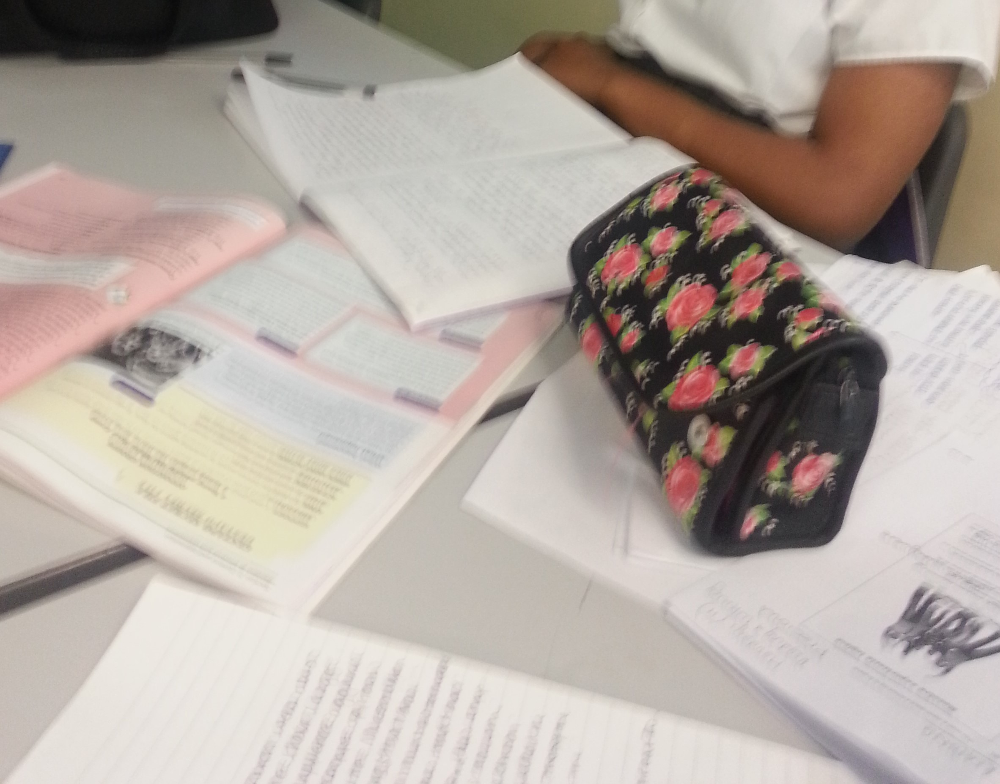
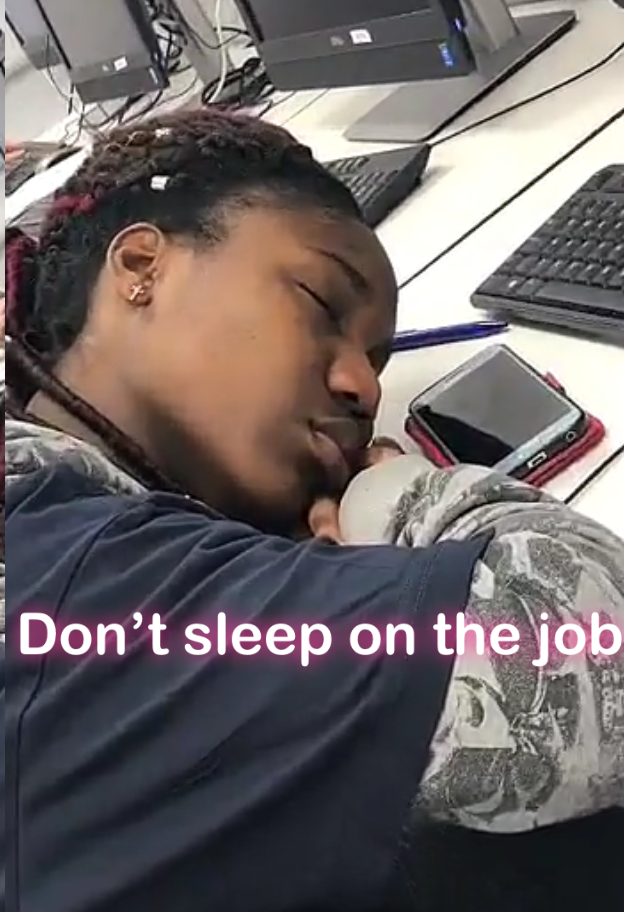

# My Educational History

BSc Computer Science and Mathematics, University of York (*Sep 2019- July 2022*)

	Expected Grade: (1st Class)s
	Modules: Calculus, Algebra, Theory (Formal Languages and Automata)
	Software: Foundation of Python, Introduction to Data Science,
			Object Oriented Data Structures in Java

Langley Park School for Boys (*Sep 2015 – July 2018*)

	-Final Grades 
		A-Level: Mathematics (A), Chemistry (A), & Further Mathematics (B)
	- First Attempt
		A-Level: Mathematics (B), Chemistry(D) & Further Mathematics (E or D
			*I tried so hard to forget these grade I now I have - irony*)
	- AS Level
		Mathematics, Chemistry, Further Maths, Physics (bdee)

Harris Academy Bromley *Sep 2010 – July 2015*

	-Top 10 Student of 2015
	-Top 3 Student in Mathematics fron year 2013-2015 
	-13 GCSE(A*-B) including Maths (A*) and English Language (B)		

# My Educational Journey (Blog Post)

I did quite well in my GCSE, I got an A in year in GCSE Mathematics in Year 9 and got a B in English Langauge, even though I got a U in my Decemeber Mock and I was in the bottom set for 3 years. One lesson to take from my secondary moment is __to not let teachers define your ability__, exams and class should not be your only reflection of your talent.

<h3>Then came the dreadful Alevels</h3>

