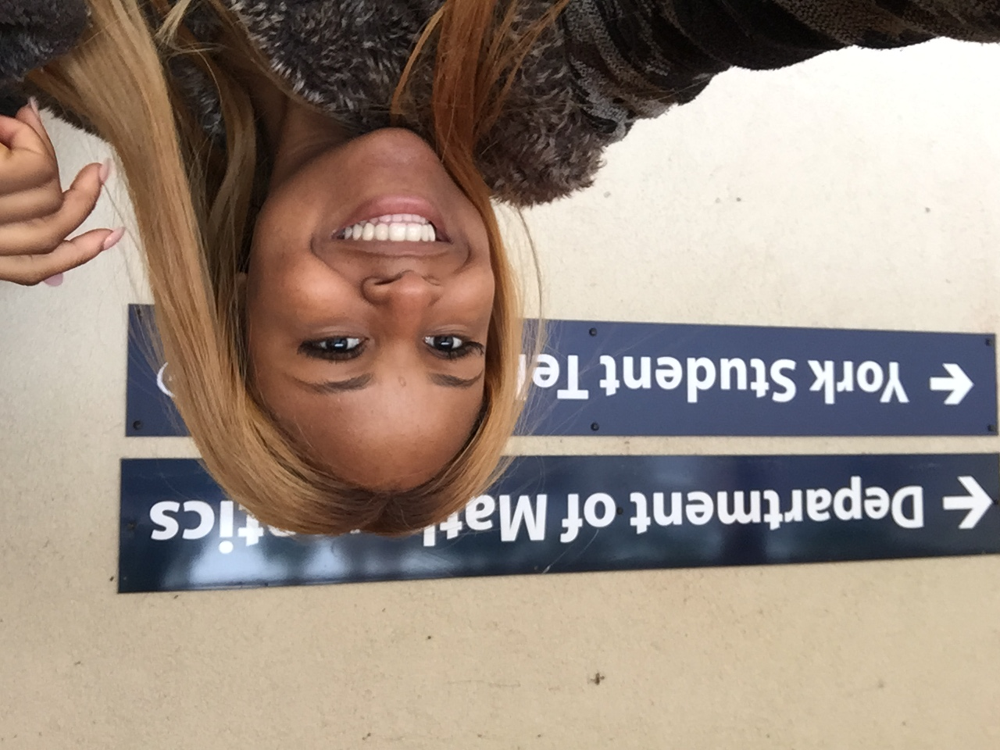
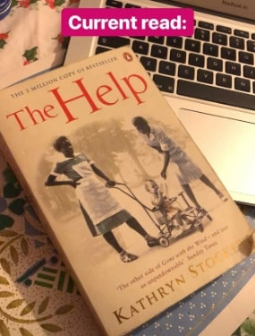
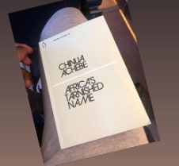
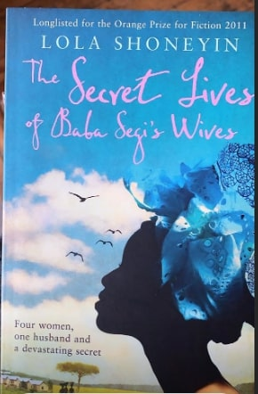

<h2 class="red-text">
	My name is __Precious Adewunmi__, I am a first year Computer Science and Mathematics student at the University of York.
</h2>

 Throwback to first year

<h3> My passions </h3>

<button type="button"> Passions</button>
- Nigerian Cusine and <a href="https://www.instagram.com/cookingwithsach/" target="_blank">Cooking Recipe</a> 

- Numbers and Data (*typical of a mathematics student*)

- Reading - Here is my [My Reading List](https://www.youtube.com/watch?v=1K645YXdEJY) if you have any recommend book please link it  <input type="text" placeholder="BookstoRead URL">

- Inspiring females to students to enjoy STEM subjects and assiting students in failing educational system to excel. 

I am inquistive about **Data security**, such as what are cookies, how big tech firm process our data and how do thrid party companies benefit from this. 

My education journey hasn't been conventional, but the mentorship and support I have recieved has helped me to remain resillent. I hope to help others like myself who face adversity.

__If I can do one thing it would be to help others.__

